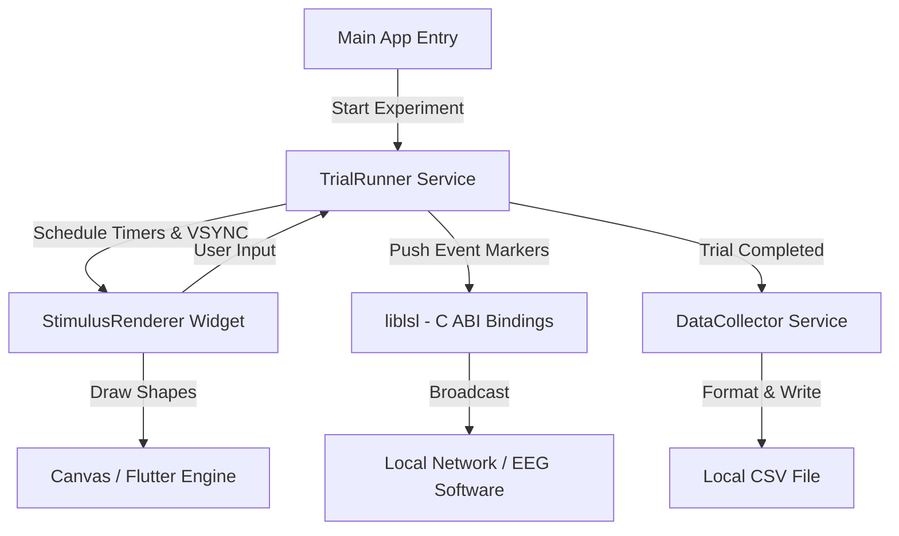

# Adaptive Working Memory App (Flutter)

A high-precision cognitive psychological paradigm application built with **Flutter**. 
This application measures spatial working memory capacity using a computerized change-detection task, whilst emitting time-locked synchronization markers via **Lab Streaming Layer (LSL)** for simultaneous EEG data acquisition.

---

## Key Capabilities

1. **Change Detection Paradigm**: A spatial working memory task presenting arrays of red rectangles where users detect orientation changes across memory and test arrays.
2. **Lab Streaming Layer (LSL) Integration**: Emits real-time, low-latency event markers via an LSL Outlet, allowing seamless synchronization with EEG recording systems (e.g. BrainVision, NeuroScan, openbci).
3. **High-Precision ERP Engine**: VSYNC-locked stimulus presentation using Flutter's `CustomPaint` and timer scheduling, ensuring millisecond-level markers that match standard experimental software (e.g. PsychoPy/E-Prime).
4. **Local Data Persistence**: Automatically logs comprehensive trial-by-trial results, reaction times, and accuracy scores into standardized `.csv` files stored securely in the app's documents directory.
5. **Cross-Platform**: Fully supports building for Android, iOS, and Linux for field research and diverse laboratory environments.

---

## Directory Structure

```text
adaptive_wmapp_flutter/
├── android/                   # Android native code (Java/Kotlin, Gradle configs)
├── ios/                       # iOS native code (Swift, Xcode configs)
├── linux/                     # Linux native code (C++, CMake configs)
├── lib/                       # Flutter Application source
│   ├── models/                # Data models (Trial configuration, Results)
│   ├── screens/               # App UI views (Experiment Runner, Results Screen)
│   ├── services/              # Core business logic (Data Collector, LSL Trial Runner)
│   ├── widgets/               # UI components (Custom Stimulus Renderer)
│   └── main.dart              # Application entry point
├── pubspec.yaml               # Flutter dependencies (liblsl, csv, etc.)
└── README.md                  # This document
```

---

## Modality Specifications

### 1. Lab Streaming Layer (LSL)
* **LSL Outlet**: Creates a local LSL stream named `AdaptiveWM_Markers` of type `Markers`.
* **Marker Codes**: Uses predefined integer codes to signify experimental events:
  - `88`: Fixation cross onset
  - `21`: Encoding array (Set size 2, left cue)
  - `29`: Encoding array (Set size 2, right cue)
  - `49`: Encoding array (Set size 4, right cue)
  - `10`: User Response (Mismatch)
  - `11`: User Response (Match)
  - `12`: User Response (Omission / Timeout)

### 2. CSV Data Logging
* **Behavioral Records**: Each session generates a `<timestamp>_results.csv` containing:
  - `trialIndex`: Sequence number of the trial.
  - `setSize`: Memory load (number of rectangles).
  - `cuedSide`: The attended visual hemifield.
  - `changed`: Whether the target item actually changed orientation.
  - `userResponse`: The recorded response from the participant.
  - `isCorrect`: Accuracy Boolean.
  - `reactionTimeMs`: Millisecond precision reaction time from the test array onset.

---

## System Architecture



---

## Step-by-Step Build & Setup Guide

### 1. Prerequisites
Ensure you have the following installed on your machine:
* **Flutter SDK** (`stable` channel)
* **Android Studio / Android SDK** (for Android builds)
* **Xcode** (for iOS builds, requires macOS)
* **CMake & Clang** (for Linux builds)

### 2. Install Dependencies
Open a terminal in the `adaptive_wmapp_flutter` directory and fetch the Dart packages:
```bash
flutter pub get
```

### 3. Run and Deploy Locally
You can run the app in debug mode on an attached device or emulator:
```bash
flutter run
```

Or build a release version for your specific platform:
```bash
flutter build apk --release    # Android
flutter build ios --release    # iOS
flutter build linux --release  # Linux
```

### 4. Automated Cloud Builds (GitHub Actions)
This project is configured with a GitHub Actions CI/CD pipeline (`.github/workflows/flutter_build.yml`). 
Simply push your code to the `master` or `main` branch:
1. GitHub will automatically provision Ubuntu and macOS runners.
2. The pipeline will build the Android APK, Linux Executable, and iOS App Bundle in parallel.
3. Once completed, the binaries can be downloaded directly from the **Actions** tab in your GitHub repository.

---

## Implementation Details

### LSL Marker Synchronization
To ensure precise timing with the EEG recording, markers are dispatched using the `liblsl` FFI bindings at the exact moment the stimulus is requested to render:
```dart
void _pushMarker(int markerCode) {
  if (outlet != null) {
    final sample = calloc<Int32>();
    sample.value = markerCode;
    bindings.lsl_push_sample_i(outlet!, sample);
    calloc.free(sample);
  }
}
```

### Local CSV Writing
The `DataCollector` uses the `csv` package to dynamically generate and append rows to a CSV file stored in the platform's standard application documents directory (`path_provider`). This prevents data loss in case of an unexpected crash during long recording sessions.
