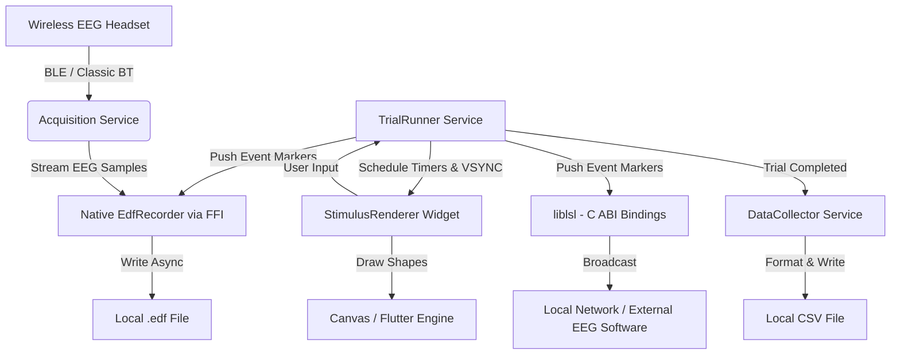

# Adaptive Change Detection Memory Task (ACDMT)

A high-precision cognitive psychological paradigm application built with **Flutter**, featuring native EEG hardware integration and raw data recording capabilities.

This application measures spatial working memory capacity using a computerized change-detection task. It seamlessly connects to wireless EEG headsets (via Bluetooth/BLE) and emits time-locked synchronization markers alongside high-resolution raw EEG streams directly into standardized **.edf (European Data Format)** files. It also broadcasts these streams over the **Lab Streaming Layer (LSL)**.

---

## Key Capabilities

1. **Change Detection Paradigm**: A spatial working memory task presenting arrays of red rectangles where users detect orientation changes across memory and test arrays.
2. **Native EEG Hardware Integration**: Connects via Classic Bluetooth or BLE to physiological hardware (e.g., Orbit, EpiDome), streaming raw EEG samples seamlessly into the app.
3. **Local .EDF Recording**: Fully standalone offline data collection! The app natively writes both raw EEG waveforms and synchronized experimental markers directly to standard `.edf` files using a highly optimized Rust native core.
4. **Lab Streaming Layer (LSL) Integration**: Emits real-time, low-latency event markers via an LSL Outlet, allowing seamless synchronization with external EEG recording systems (e.g. BrainVision, NeuroScan, openbci).
5. **High-Precision ERP Engine**: VSYNC-locked stimulus presentation using Flutter's `CustomPaint` and timer scheduling, ensuring millisecond-level markers that match standard experimental software (e.g. PsychoPy/E-Prime).
6. **Local Data Persistence**: Automatically logs comprehensive trial-by-trial results, reaction times, and accuracy scores into standardized `.csv` files stored securely in the app's documents directory.
7. **Cross-Platform**: Fully supports building for Android, iOS, and Linux for field research and diverse laboratory environments.

---

## 📥 Downloads & Installables
Pre-compiled binaries for all supported operating systems are automatically generated via GitHub Actions on every commit.

* 📱 **[Android APK](https://github.com/rahulvenugopal/AdaptiveWMApp/actions/workflows/flutter_build.yml)**: Download the latest `Android-APK.zip` from the artifacts section to install directly on any Android device.
* 🍏 **[iOS App Bundle](https://github.com/rahulvenugopal/AdaptiveWMApp/actions/workflows/flutter_build.yml)**: Download the `iOS-Build.zip` artifact. (Requires Xcode/macOS for device provisioning).
* 🐧 **[Linux Executable](https://github.com/rahulvenugopal/AdaptiveWMApp/actions/workflows/flutter_build.yml)**: Download the `Linux-Build.zip` for Debian-based systems.

> **Note:** To access these files, click on the most recent successful run in the [GitHub Actions tab](https://github.com/rahulvenugopal/AdaptiveWMApp/actions), scroll to the bottom, and click on the desired artifact under "Artifacts".

---

## Directory Structure

```text
adaptive_wmapp_flutter/
├── android/                   # Android native code (Java/Kotlin, JNI libs, Gradle configs)
├── ios/                       # iOS native code (Swift, Xcode configs)
├── rust/                      # Native Rust core for ultra-fast EDF writing & EEG processing
├── third_party/               # Custom patched dependencies (e.g. flutter_bluetooth_serial)
├── lib/                       # Flutter Application source
│   ├── models/                # Data models (Trial configuration, Results)
│   ├── screens/               # App UI views (Setup Screen, Experiment Runner, Results Screen)
│   ├── services/              # Core business logic (Acquisition, Native EDF Recorder, LSL Trial Runner)
│   ├── widgets/               # UI components (Custom Stimulus Renderer)
│   └── main.dart              # Application entry point
├── pubspec.yaml               # Flutter dependencies (liblsl, flutter_blue_plus, etc.)
└── README.md                  # This document
```

---

## Modality Specifications

### 1. Standalone EEG Recording (.edf)
* **Rust Native Core**: The application employs a compiled Rust library (`libangel_eeg_core.so` / `.dylib`) invoked via Dart FFI. This handles high-throughput EEG sampling and marker synchronization without Dart garbage collection pauses.
* **Outputs**: Raw multiplexed EEG data coupled exactly with the stimulus markers are saved locally as `.edf` files in the device's Documents folder.

### 2. Lab Streaming Layer (LSL)
* **LSL Outlet**: Creates a local LSL stream named `AdaptiveWM_Markers` of type `Markers`.
* **Marker Codes**: Uses predefined integer codes to signify experimental events:
  - `88`: Fixation cross onset
  - `21`: Encoding array (Set size 2, left cue)
  - `29`: Encoding array (Set size 2, right cue)
  - `49`: Encoding array (Set size 4, right cue)
  - `10`: User Response (Mismatch)
  - `11`: User Response (Match)
  - `12`: User Response (Omission / Timeout)

### 3. CSV Data Logging
* **Behavioral Records**: Each session generates a `<timestamp>_results.csv` containing:
  - `trialIndex`: Sequence number of the trial.
  - `setSize`: Memory load (number of rectangles).
  - `cuedSide`: The attended visual hemifield.
  - `changed`: Whether the target item actually changed orientation.
  - `userResponse`: The recorded response from the participant.
  - `isCorrect`: Accuracy Boolean.
  - `reactionTimeMs`: Millisecond precision reaction time from the test array onset.

---

## System Architecture



---

## Step-by-Step Build & Setup Guide

### 1. Prerequisites
Ensure you have the following installed on your machine:
* **Flutter SDK** (`stable` channel)
* **Android Studio / Android SDK** (for Android builds)
* **Xcode** (for iOS builds, requires macOS)
* **CMake & Clang** (for Linux builds)

### 2. Install Dependencies
Open a terminal in the `adaptive_wmapp_flutter` directory and fetch the Dart packages:
```bash
flutter pub get
```

### 3. Run and Deploy Locally
You can run the app in debug mode on an attached Android tablet, iPad, or emulator:
```bash
flutter run
```

Or build a release version for your specific platform:
```bash
flutter build apk --release    # Android
flutter build ios --release    # iOS
flutter build linux --release  # Linux
```

### 4. Automated Cloud Builds (GitHub Actions)
This project is configured with a GitHub Actions CI/CD pipeline (`.github/workflows/flutter_build.yml`). 
Simply push your code to the `master` or `main` branch:
1. GitHub will automatically provision Ubuntu and macOS runners.
2. It handles NDK location and custom dependency overrides robustly.
3. The pipeline will build the Android APK, Linux Executable, and iOS App Bundle in parallel.
4. Once completed, the binaries can be downloaded directly from the **Actions** tab in your GitHub repository.

---

## Implementation Details

### Rust Native Integration & EDF
The heavy lifting of file saving and real-time buffer management is fully decoupled from the UI thread by writing the core in Rust and wrapping it using `dart:ffi`. This ensures that even during demanding 120Hz UI rendering for the cognitive task, EEG samples are never dropped or delayed.

### Fallback LSL Marker Synchronization
For external synchronization, markers are dispatched using the `liblsl` FFI bindings at the exact moment the stimulus is requested to render. 
```dart
void _pushMarker(int markerCode) {
  // Local .edf file marker
  edfRecorder.setMarker(markerCode);
  
  // Network LSL marker broadcast
  if (outlet != null) {
    final sample = calloc<Int32>();
    sample.value = markerCode;
    bindings.lsl_push_sample_i(outlet!, sample);
    calloc.free(sample);
  }
}
```
